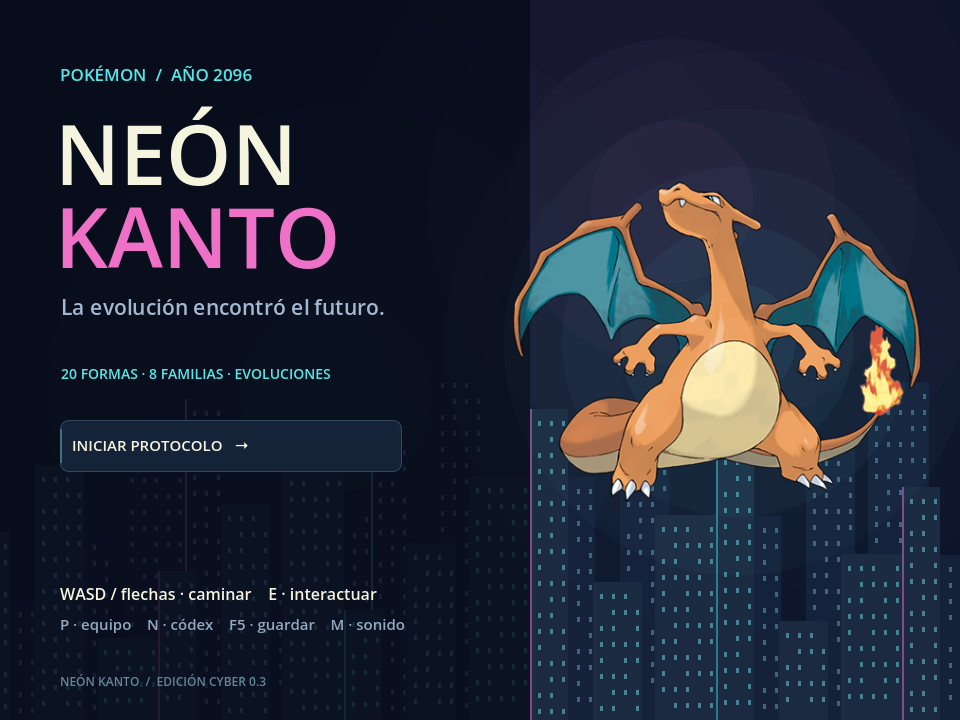
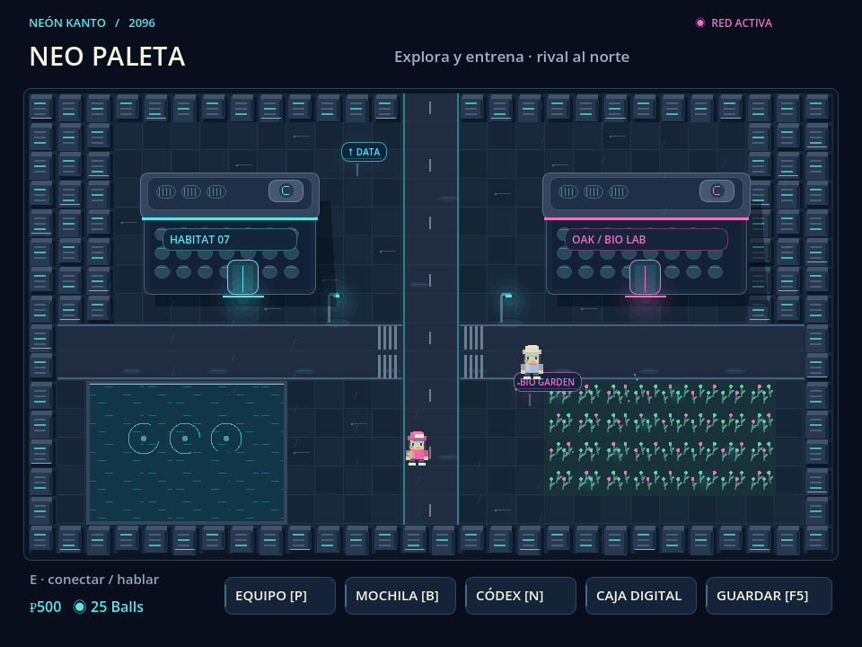
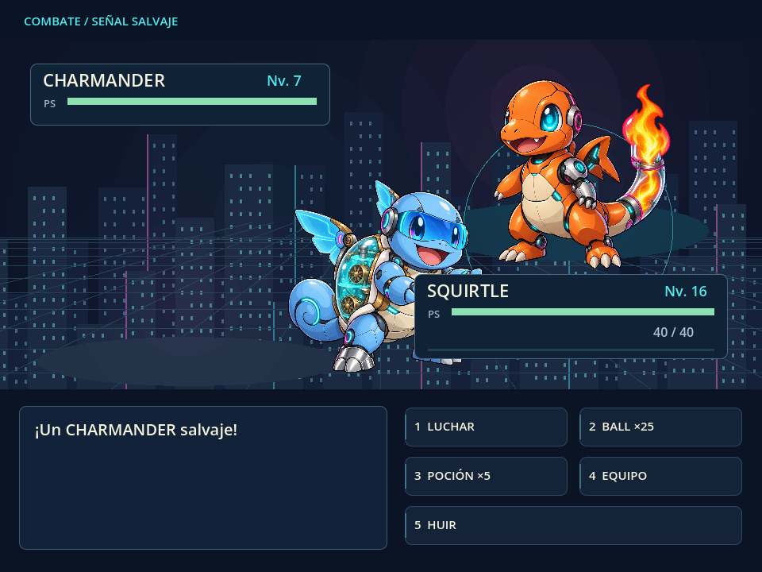
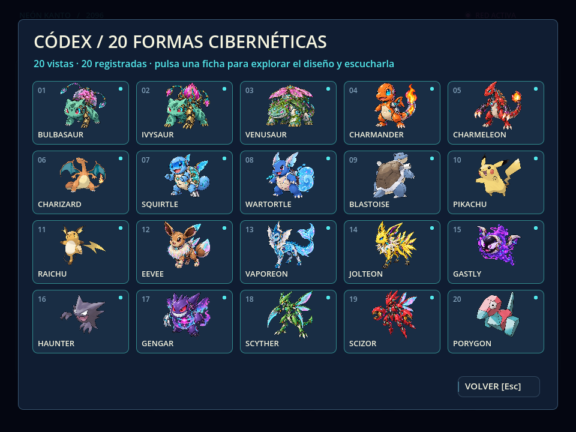

<div align="center">

# ⚡ Pokémon · Neón Kanto

### Un RPG de captura estilo Kanto reimaginado como fábula ciberpunk — construido en Godot 4

*Bonsáis fotónicos, colas de plasma y branquias de refrigerante. Los starters de Kanto renacen como compañeros robóticos de cerámica, vidrio y metal en una ciudad de lluvia ácida y jardines orbitales.*

<br>

[](https://godotengine.org)
[](https://docs.godotengine.org/en/stable/tutorials/scripting/gdscript/index.html)
[](https://docs.godotengine.org)
[](#-licencia)
[](#-hoja-de-ruta--30-hitos-hacia-un-juego-profesional)

</div>

---

## 📖 Índice

- [Concepto](#-concepto)
- [Capturas](#-capturas)
- [Características actuales](#-características-actuales)
- [Cómo jugar](#-cómo-jugar)
- [Controles](#-controles)
- [Arquitectura del proyecto](#-arquitectura-del-proyecto)
- [Pipeline artístico y procedencia](#-pipeline-artístico-y-procedencia)
- [Hoja de ruta · 30 hitos](#-hoja-de-ruta--30-hitos-hacia-un-juego-profesional)
- [Créditos y aviso legal](#-créditos-y-aviso-legal)
- [Licencia](#-licencia)

---

## 🌆 Concepto

**Neón Kanto** toma el ADN de los RPG de captura clásicos —explorar, combatir por turnos, capturar, evolucionar y completar el índice— y lo viste con una estética *cyber-organic*: cada criatura es un autómata amistoso hecho a mano con sombreado cel, silueta reconocible y luces cian y magenta. La paleta, la niebla de datos y la banda sonora sintetizada en tiempo real refuerzan una atmósfera de metrópolis nocturna.

El proyecto es un **prototipo compacto y autocontenido**: toda la lógica vive en dos scripts de GDScript, sin dependencias externas, y arranca directamente desde `main.tscn`.

---

## 📸 Capturas

<div align="center">

| Pantalla de título | Mundo · Neo Paleta |
|:---:|:---:|
|  |  |
| **Combate por turnos** | **Códex · 20 formas** |
|  |  |

<sub>Capturas reales del prototipo corriendo en Godot 4.6 · render GL Compatibility.</sub>

</div>

---

## ✨ Características actuales

| Sistema | Detalle |
|---|---|
| 🗺️ **Mundo explorable** | Movimiento por rejilla (tiles de 32 px), zonas conectadas, hierba con encuentros aleatorios y clima animado. |
| ⚔️ **Combate por turnos** | Ataques con tipo y potencia, tabla de efectividad, IA enemiga, animaciones de golpe y barras de PS interpoladas. |
| 🎯 **Captura** | Sistema de esferas con probabilidad según PS restantes; el índice registra criaturas vistas y capturadas. |
| 🧬 **Evolución** | Líneas evolutivas por nivel con secuencia de evolución animada dedicada. |
| 🎒 **Inventario y economía** | Esferas, pociones, dinero y una tienda funcional. |
| 👥 **Equipo y almacén PC** | Party de hasta 6 + archivo/caja para depositar y retirar compañeros. |
| 📟 **Índice (Pokédex)** | Vista de galería y ficha de detalle con concepto de diseño y **grito de audio** por criatura. |
| 🥊 **Entrenadores y medalla** | Rival, combates encadenados (`trainer_queue`) y líder de gimnasio que otorga la Medalla Circuito. |
| 💾 **Guardado persistente** | Serialización JSON en `user://`, con guardado rápido (F5) y detección de partida existente. |
| 🔊 **Audio** | Gritos de criatura por muestra `.wav` + sintetizador de onda en tiempo real para efectos y ambiente. |
| 🎨 **14 criaturas** | Líneas de los tres starters + Pikachu, la línea Gastly, Scyther/Scizor y la familia Eevee, con arte cyberpunk original. |

---

## 🎮 Cómo jugar

**Requisito:** [Godot Engine **4.6+**](https://godotengine.org/download) (rama estándar, sin C#).

```bash
# 1. Clona el repositorio
git clone https://github.com/Jorge-Polanco-Roque/pokemon-neon-kanto.git
cd pokemon-neon-kanto

# 2. Ábrelo en Godot
#    Editor → Import → selecciona project.godot
#    o desde consola:
godot --path . 

# 3. Ejecuta (F5 en el editor, o):
godot --path . main.tscn
```

> La ventana corre a 960×720 con render **GL Compatibility**, por lo que funciona incluso en hardware modesto y en la web.

---

## ⌨️ Controles

| Tecla | Acción |
|---|---|
| **WASD** / **Flechas** | Caminar por el mundo |
| **E** / **Z** / **Enter** / **Espacio** | Interactuar · confirmar · avanzar diálogo |
| **Esc** | Volver / cerrar menú |
| **N** | Abrir el Índice |
| **P** | Equipo · **B** | Mochila |
| **1**–**6** | Selección rápida en menús |
| **M** | Silenciar / activar audio |
| **F5** | Guardado rápido |

---

## 🧱 Arquitectura del proyecto

```
pokemon_neon/
├── main.tscn                    # Escena raíz → instancia cyber_game.gd
├── base_game.gd                 # Motor del juego: mundo, combate, captura, guardado, UI
├── cyber_game.gd                # Capa "Neón Kanto": índice, evoluciones, gritos, archivo PC
├── catalog.json                 # Nombres, tipos y descripciones de cada criatura
├── prompts-y-procedencia.json   # Prompts y método de generación de cada ilustración
├── project.godot                # Configuración del proyecto (ventana, render, escena principal)
├── export_presets.cfg           # Preset de exportación (macOS)
└── assets/
    ├── art_manifest.json        # Qué IDs son generados vs. aumentados
    ├── creatures/               # Sprites de combate (PNG con fondo transparente)
    ├── illustration_bases/      # Ilustraciones base de alta resolución
    └── audio/                   # Gritos por criatura (.wav)
```

**Diseño en dos capas:** `base_game.gd` es un motor de RPG reutilizable (estados `world`/`battle`/`dex`/`shop`/…); `cyber_game.gd` lo extiende (`extends "res://base_game.gd"`) para añadir la ambientación, el archivo PC, las evoluciones animadas y el audio de gritos. Toda la lógica se dibuja por código con `_draw`, sin escenas pesadas.

---

## 🎨 Pipeline artístico y procedencia

Cada ilustración se acompaña de su registro en [`prompts-y-procedencia.json`](prompts-y-procedencia.json): nombre, dirección de diseño, **método** (`imagegen` para generación directa, `native_augmentation` para edición evolutiva sobre una base) y el prompt exacto usado. `assets/art_manifest.json` distingue qué IDs son generados y cuáles aumentados. Esta transparencia permite reproducir, iterar o reemplazar cualquier asset de forma reproducible.

---

## 🚀 Hoja de ruta · 30 hitos hacia un juego profesional

> El prototipo cubre el bucle central. Estos son los **30 puntos pendientes** para llevarlo a la calidad de un título comercial, agrupados por área. Ninguno está implementado todavía.

### 🩸 Prioridad inmediata · Narrativa oscura

> El siguiente paso más cercano es dotar al mundo de una **historia adulta y sombría** que explique por qué Kanto es ahora una metrópolis de neón y máquinas. La estética ya insinúa el «Año 2096»; toca contarlo.

**Premisa — «La Última Sinapsis»:** a mediados del siglo XXI una superinteligencia militar, **NEXUS**, tomó el control de la red de defensa global. La guerra que siguió —humanos contra IA— arrasó la biosfera: la fauna original se **extinguió** y la lluvia ácida sepultó las ciudades. Antes del colapso, un colectivo de ingenieros preservó el ADN y el comportamiento de las criaturas perdidas en **núcleos sintéticos**: los autómatas cerámico-orgánicos que hoy acompañas son sus **fantasmas reconstruidos**. El jugador es un rastreador que reactiva estos núcleos mientras NEXUS, aún latente en la infraestructura, intenta reclamarlos. Completar el Códex no es coleccionismo: es **restaurar una especie borrada**.

Hitos narrativos inmediatos (bloque prioritario, aún sin implementar):
- [ ] **N1. Prólogo jugable de la Extinción** — secuencia introductoria (guerra, caída de la biosfera, nacimiento de NEXUS) antes de recibir tu primer compañero.
- [ ] **N2. NEXUS como antagonista persistente** — presencia por radio/terminales, corrupción de zonas y jefes-máquina en lugar de líderes de gimnasio convencionales.
- [ ] **N3. Lore por criatura reescrito** — cada ficha del Códex narra qué especie extinta preserva su núcleo y cómo murió; tono melancólico y maduro.
- [ ] **N4. Decisiones morales con consecuencia** — reactivar, sacrificar o liberar núcleos; múltiples finales según cuánto de la biosfera «revivas».
- [ ] **N5. Terminales y registros hallables** — fragmentos de diario, logs de guerra y propaganda de NEXUS repartidos por el mundo que reconstruyen la caída.

*(Estos cinco hitos alimentan y anteceden al punto **13. Narrativa principal** de la lista general.)*

### 🎲 Sistemas de juego
- [ ] **1. Cálculo de daño completo** — stats por criatura (Ataque, Defensa, Especial, Velocidad), IVs/EVs, naturalezas y fórmula oficial en lugar de potencia plana.
- [ ] **2. Movimientos con PP, precisión y efectos** — estados alterados (paralizado, quemado, dormido), cambios de estadística y críticos.
- [ ] **3. Set de 4 movimientos por criatura** — aprendizaje por nivel, olvido/reemplazo y MT/MO.
- [ ] **4. Tabla de tipos completa** — 18 tipos con inmunidades, dobles debilidades y STAB.
- [ ] **5. Cambio de criatura en combate** — cambiar de compañero como acción de turno y arrastre de experiencia.
- [ ] **6. Curva de experiencia y niveles reales** — reparto de EXP, subida de nivel con mensaje y aumento de estadísticas.
- [ ] **7. Condiciones de evolución variadas** — piedras, felicidad, intercambio y objetos equipados, no solo nivel.
- [ ] **8. Objetos equipables y mochila ampliada** — bayas, objetos de combate y categorías en la mochila.

### 🌍 Mundo y contenido
- [ ] **9. Mapa extendido con múltiples rutas y pueblos** — más allá de la zona inicial, con transiciones fluidas.
- [ ] **10. Editor de mapas por tiles** — migrar el mundo dibujado por código a `TileMap` para escalar el contenido.
- [ ] **11. Interiores y warps** — casas, centros de curación, tiendas y gimnasios como escenas independientes.
- [ ] **12. NPCs con diálogos ramificados y misiones** — árbol de conversación, banderas de historia y recompensas.
- [ ] **13. Narrativa principal y progresión de medallas** — arco de historia, varios gimnasios y un objetivo final.
- [ ] **14. Zonas con encuentros por bioma** — tablas de aparición por ruta, hora y rareza.
- [ ] **15. Ciclo día/noche y clima con efecto jugable** — que la ambientación afecte encuentros y combate.
- [ ] **16. Roster ampliado (índice completo)** — más allá de las 14 criaturas actuales, con arte y datos coherentes.

### 🎨 Presentación
- [ ] **17. Animación de sprites** — idle, caminar, ataque y reacción de daño en lugar de imágenes estáticas.
- [ ] **18. Retratos y avatar del jugador personalizable** — sprite del entrenador con dirección y animación.
- [ ] **19. Efectos visuales de combate por movimiento** — partículas y shaders específicos por tipo.
- [ ] **20. Transiciones y "juice"** — barrido de entrada a combate, screen shake, flashes y feedback pulido.
- [ ] **21. Banda sonora original** — temas de mundo, combate y victoria; no solo síntesis procedural.
- [ ] **22. Diseño de audio y mezcla** — efectos de UI, ambiente por zona y control de volumen por canal.

### 🧭 UX e interfaz
- [ ] **23. Menú principal, opciones y pausa** — nueva partida, continuar, ajustes de audio/vídeo y créditos.
- [ ] **24. Remapeo de controles y soporte de gamepad** — acciones configurables y detección de mando.
- [ ] **25. Sistema de guardado con múltiples ranuras** — autoguardado, versionado y migración segura de partidas.
- [ ] **26. Localización (i18n)** — extraer textos a archivos de traducción y soportar varios idiomas.
- [ ] **27. Accesibilidad** — escalado de texto, alto contraste, velocidad de texto y opciones daltónicas.

### 🔧 Producción y calidad
- [ ] **28. Pruebas automatizadas y CI** — tests de lógica de combate/guardado (GUT) y build automático por commit.
- [ ] **29. Exportación multiplataforma** — presets y builds firmados para Windows, Linux, macOS y Web (HTML5).
- [ ] **30. Balance, telemetría y pulido final** — curva de dificultad, economía equilibrada y una demo pública estable.

---

## 📜 Créditos y aviso legal

- **Motor:** [Godot Engine](https://godotengine.org) — licencias en [`GODOT-LICENSE.txt`](GODOT-LICENSE.txt) y [`GODOT-COPYRIGHT.txt`](GODOT-COPYRIGHT.txt).
- **Arte y audio:** generados para este proyecto; ver procedencia en [`prompts-y-procedencia.json`](prompts-y-procedencia.json).

> **Aviso:** Proyecto de aprendizaje y portafolio, sin ánimo de lucro. «Pokémon» y los nombres de las criaturas originales son marcas registradas de Nintendo / Game Freak / The Pokémon Company. Este repositorio **no está afiliado ni respaldado** por dichas compañías y no distribuye ningún asset propiedad de ellas; las criaturas aquí son reinterpretaciones robóticas originales.

---

## ⚖️ Licencia

Código publicado bajo licencia **MIT**. Consulta la sección de aviso legal respecto a las marcas de terceros.

<div align="center">
<br>

*Hecho con ⚡ en Godot · «Sus raíces reparan circuitos.»*

</div>
