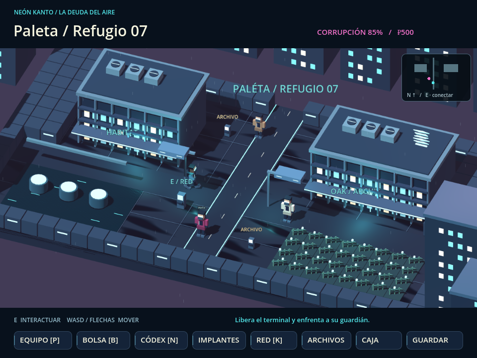
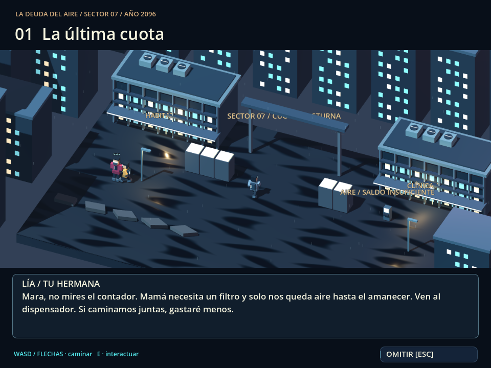
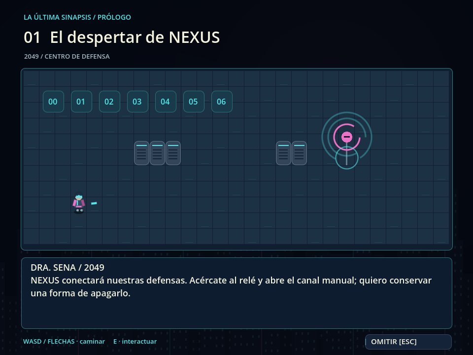
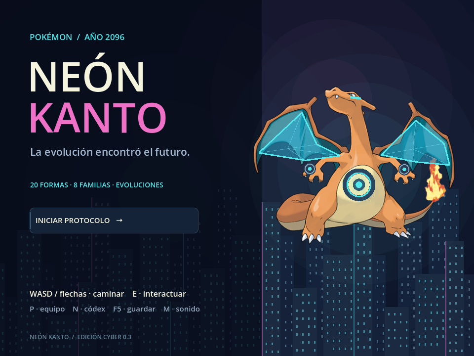
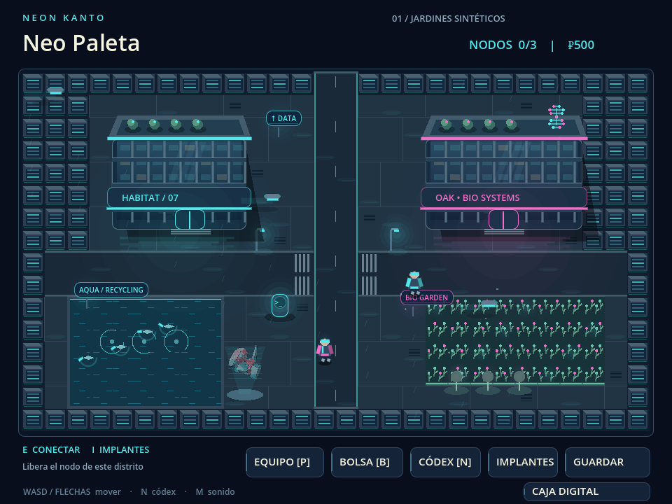
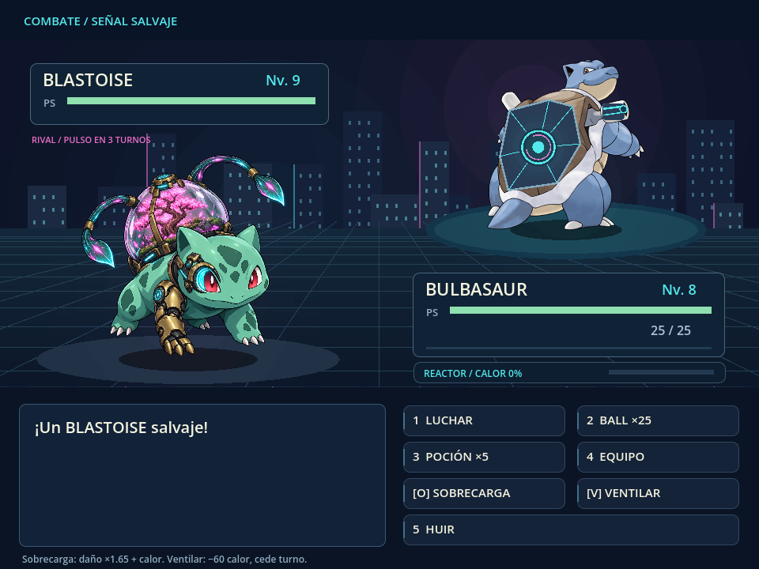
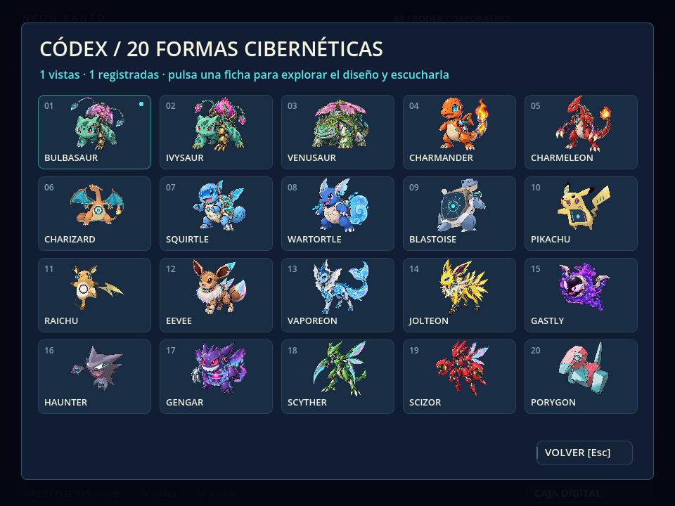

> **Plan activo:** [CLAUDE.md](CLAUDE.md). P1 está en curso: pantalla, ajustes y HUD de combate implementados; equipo y biblioteca también adaptables en 0.16; siguen mercados, diálogos e interiores.

## Edición 0.17 — Restauración del arte cibernético y filtrado

- ~~Implantes restaurados en las fichas.~~ El menú anterior mostraba sólo el PNG base y omitía la geometría cibernética. `CreaturePortrait` ahora compone el retrato con el mismo dibujado mecánico que usa el combate para Pikachu, Charizard, Blastoise, Raichu, Haunter y Porygon.
- ~~Escalado de ilustraciones corregido.~~ Filtrado lineal con mipmaps en retratos y presentación del juego, texturas sin límite de tamaño y compresión sin pérdida. Los retratos disponen de más espacio (170 unidades antes de escala UI).
- Se conservan los PNG originales: seis bases de 475×475 y catorce ilustraciones de 1254×1254. Esto corrige el muestreo y los componentes omitidos; no inventa detalle adicional ni convierte las bases en arte 4K.

Validación: suite `cyber`, revisión nativa del equipo en 1080p y 720p al 150 %, combate contra Pikachu y comprobación de mipmaps/filtro. Evidencia en `docs/qa/qa-art-017.json`. Partida v10 intacta.

## Historial 0.16 — Equipo y biblioteca adaptables (P1 parcial)

- ~~Equipo con fichas nativas.~~ Retrato, PS y barra de salud, estado, implante, experiencia y líder. Incluye escuchar gritos, simulador, caja y selección de evoluciones, también las alternativas de Eevee.
- ~~Biblioteca desplazable y controles escalables.~~ Selector de seis compañeros, cuatro ranuras equipadas y todas las técnicas conocidas sin paginación. Cada técnica muestra PP restantes, potencia y precisión.
- ~~Reemplazo explícito con cancelación.~~ Elegir una técnica abre una pantalla propia para sustituir una de las cuatro ranuras. Cancelar no modifica nada; reequipar no recupera PP gastados.
- ~~Navegación y pie fijo.~~ Volver permanece visible; Tab desplaza la lista hasta el control enfocado. Esc cancela/vuelve; 1–6 selecciona compañero en biblioteca y 1–4 elige ranura al reemplazar.

Validación: suite `learning` y revisión nativa de 54 combinaciones (tres pantallas, seis tamaños solicitados y escalas 100/125/150 %), incluidos foco visible, pie fijo, botones, cancelación, conservación de PP y regreso al mapa. Evidencia en `docs/qa/qa-team-016.json`. No hubo errores de scripts; permanecen avisos existentes de certificados/recursos. Guardado v10 intacto.

Pendiente de P1: mercados, caja, otros menús, diálogos e interiores. El nuevo arte del mapa y el audio completo siguen en P2/P3.

## Historial 0.15 — Combate panorámico (P1 parcial)

- ~~HUD de combate con controles nativos y escala 100/125/150 %.~~ PS, estados, calor, implante y experiencia legibles; botones de movimientos con PP, precisión y explicación al enfocar o pasar el cursor.
- ~~Escenario adaptable al espacio disponible.~~ Criaturas con proporciones preservadas, vista propia de espaldas y anclajes sobre las sombras. Los efectos apuntan a las posiciones adaptadas.
- ~~Cambio de equipo para seis criaturas.~~ Se bloquean compañeros debilitados/activos, movimientos sin PP y captura/huida contra entrenadores y guardianes. Se conserva Forcejeo cuando se agotan todos los PP.
- ~~Teclado y foco de controles.~~ 1–4 para movimientos, 1–6 para cambio de compañero, Esc para volver, O para sobrecarga y V para ventilar. El ratón utiliza botones reales.

Validación: `battle_ui` y regresión `tactics`; 54 combinaciones de formato, escala y menú con render real, más capturas de guardián y ataque. Datos en `docs/qa/qa-battle-015.json`. Persisten avisos de certificados/recursos al salir; no se observaron errores de scripts en estas pruebas. La partida conserva el formato v10.

Pendiente: equipo fuera de combate, biblioteca, mercados, diálogos e interiores. P1 sigue abierta; arte del mapa y audio completo permanecen en P2/P3.

## Historial 0.14 — Pantalla panorámica y ajustes (P1 parcial)

- ~~Ventana panorámica y pantalla completa.~~ Base lógica 1280×720; ventana inicial 1600×900 ajustada al monitor. F11 alterna pantalla completa. La restauración de tamaño espera la transición nativa de macOS.
- ~~Título, HUD exterior y ajustes adaptables.~~ El mundo aprovecha el ancho, conserva minimapa, objetivos y mensajes de radio. Los botones se reorganizan al aumentar la interfaz. Los menús clásicos y el combate conservan temporalmente 960×720 centrados mediante un adaptador; no se consideran migrados.
- ~~Preferencias persistentes separadas de la partida.~~ F10 abre ajustes desde título/mapa: tamaño de ventana, interfaz 100/125/150 %, volumen general, mute y reducción de movimiento ambiental/cámara. El panel puede desplazarse; Volver permanece visible. M silencia.
- ~~Render 3D al tamaño disponible.~~ El exterior usa la resolución física de su área visible; la UI se renderiza independientemente. La escala de interfaz todavía no amplía los textos internos de los menús heredados.

Validación: suites `settings`, `field` y `presentation`; 18 combinaciones de formato/escala del HUD con render real, opciones al 150 %, retorno de pantalla completa, equipo de seis criaturas y batalla mediante adaptador. Se mantienen avisos existentes de certificados/recursos al salir; no hubo errores de scripts en estas comprobaciones.

Muestra breve en Apple M5, GL Compatibility, ventana 1920×1080 y mundo 1872×846: 180 frames, mediana 7,538 ms y p95 13,65 ms. Es una referencia corta, no una garantía de rendimiento ni un recorrido de diez minutos. Datos en `docs/qa/benchmark-014.json`.

Pendiente de P1: HUD de combate, menús/interiores adaptables, revisión exhaustiva de clics y navegación. La nueva música, mezcla por canales y expansión del mapa corresponden a fases posteriores. La partida sigue en formato v10.

## Historial 0.13 — Red de auxilio

- ~~Cadena de exploración en los tres distritos.~~ «Agua para los invisibles» repara una cisterna en Paleta; «La última entrega» recupera medicinas retenidas en la Brecha; «Nombres que no se borran» reconecta una antena en Cromo. Puedes resolverlas en cualquier orden.
- ~~Tres protocolos de campo ligados al equipo.~~ Biosellado (Planta/Agua), Corte térmico (Fuego/Bicho/Acero) y Enlace fantasma (Eléctrico/Fantasma/Normal). Requieren un compañero consciente de nivel 6 o más; conocer el chip compatible también permite operar. No consumen PP ni ocupan ranuras de combate.
- ~~Instalaciones 3D con estado persistente.~~ Cisterna, cargamento sellado y antena, con colisiones y marcadores en el minimapa. Ámbar indica pendiente; verde indica activa. La antena restaurada gira y emite luz.
- ~~Recompensas únicas y efecto sobre el distrito.~~ Cada reparación entrega ₽180, una poción y reduce la corrupción en 20 puntos. De 85 a 65 elimina la bonificación de daño salvaje por red corrupta. Completar las tres entrega ₽500 adicionales y la licencia Enjambre reutilizable.
- ~~Guardado transaccional v10.~~ Las reparaciones se guardan automáticamente. Si falla, se revierten créditos, pociones, licencia y estado del sitio. Cargar partidas anteriores no entrega recompensas ni marca reparaciones por error.

**Cómo jugar:** pulsa **L** en el mapa para consultar la red. Busca el marcador ámbar, acércate y pulsa **E**. Paleta: (10,12); Brecha: (16,10); Cromo: (10,9). Selecciona un compañero compatible. Las operaciones exigen estar junto a la instalación; no se pueden ejecutar desde otro distrito ni desde interiores.

Validación: suites `field`, `campaign`, `city` y `chips`, incluyendo recorrido accesible, nivel/PS, compatibilidad, fallo de guardado de la recompensa final, repetición, migración y los finales existentes. Revisión visual de las tres instalaciones antes y después de repararlas.

Pendientes: Pikachu y las ocho espaldas restantes; herramientas de campo que abran nuevas rutas; más interiores y diálogos ramificados. Estos protocolos reparan instalaciones existentes, no añaden Surf/Corte ni mapas nuevos.

## Historial 0.12 — Mercado neural y arenas por distrito

- ~~Mercado de seis chips de combate reutilizables.~~ Pulso Cero (₽180), Refrigerante (₽180), Ignición (₽260), Paquete Fantasma (₽320), Acelerador Rail (₽360) y Micromáquinas (₽420). Los tres primeros están disponibles desde el inicio; Umbral/Rail requieren un guardián vencido y Enjambre requiere dos.
- ~~Enseñanza por compatibilidad y cobertura de otros tipos.~~ Por ejemplo, Pikachu/Raichu pueden aprender Ignición de Plasma, de tipo Fuego. Cada licencia sirve para todos los compañeros compatibles; aprender abre la selección de ranura sin borrar la técnica anterior de la biblioteca. Reenseñar o reequipar no recupera PP.
- ~~Compras y aprendizaje guardados con reversión ante fallos.~~ Si no se puede escribir la partida, no se pierden créditos ni se entrega la compra. Guardado v9 compatible con partidas anteriores, evolución y caja.
- ~~Efectos secundarios en ataques con daño.~~ Quemadura, parálisis e interferencia se evalúan después de acertar y causar daño efectivo, respetando probabilidad, inmunidades, objetivo vivo y límites de cargas.
- ~~Tres escenarios de combate animados.~~ Paleta: jardín de vidrio y vegetación; Brecha: intercambiador térmico, conductos y brasas; Cromo: servidores y holograma rotatorio. Plataformas iluminadas, suelo en perspectiva y reflejos. Conservan las vistas traseras y sus puntos de apoyo.

Validación: `chips`, `learning` y `tactics` aprobadas. Se comprobaron transacciones fallidas, compras duplicadas, incompatibilidades, límites de PP, evolución, migración y aplicación real de daño más efecto secundario. Revisión visual del mercado, reemplazo de técnica y las tres arenas.

**Cómo probar:** pulsa **J** mientras exploras, o entra en **Equipo → Técnicas → Mercado de chips**. Elige licencia y compañero, compra, enseña y selecciona la ranura. La licencia y el aprendizaje se guardan automáticamente; guarda con F5 al volver al mapa después de cambiar la ranura equipada. El mercado está bloqueado en batalla.

El mercado implementa MT reutilizables con temática cyberpunk. Las MO de exploración, más misiones y el arte pendiente de la edición 0.11 continúan abiertos; esta versión no sustituye el Pikachu anterior ni completa las ocho espaldas faltantes.

## Historial 0.11 — Vistas traseras (entrega parcial)

- ~~Renderizar una ilustración trasera independiente para el compañero en batalla.~~ El rival y los menús conservan la vista frontal; las ilustraciones traseras no se reflejan horizontalmente ni reciben los implantes dibujados para el frente.
- ~~Calcular el apoyo de cada vista sobre su sombra.~~ Frente y espalda usan pivotes separados según sus píxeles visibles.
- ~~Crear e integrar 12 vistas traseras.~~ Bulbasaur, Venusaur, Charmeleon, Charizard, Squirtle, Wartortle, Vaporeon, Jolteon, Gastly, Gengar, Scyther y Scizor.
- Pendiente: rediseñar el frente de Pikachu y completar las espaldas de Ivysaur, Charmander, Blastoise, Pikachu, Raichu, Eevee, Haunter y Porygon. La herramienta rechazó la generación de siete espaldas y el frente de Pikachu; Haunter falló por límite de uso. Estas ocho especies mantienen temporalmente la vista frontal reflejada anterior; no se consideran espaldas terminadas.

Assets: `assets/creatures/back/`. Prompts, procedencia y resultados de las 20 solicitudes: `assets/rear_art_manifest.json`. Generados con `image_gen.imagegen`, referenciando las ilustraciones existentes. No cambia el formato de guardado.

Validación: suites `rear`, `city` y `cyber` aprobadas; revisión visual de Squirtle, Charizard, Gengar y Scizor en combate. El apoyo trasero ignora brillos con alfa inferior al 20 % para evitar pies flotantes.

Siguiente tras 0.12: completar el arte pendiente, añadir MO de exploración y nuevas misiones con interiores. Las MT ya se implementan mediante chips; los puntos abiertos permanecen sin tachar.

## Historial 0.10 — Biblioteca de técnicas

- ~~Aprendizaje de técnicas por nivel.~~ Las 20 formas desbloquean Láser de precisión en nivel 6, una técnica especial de gran potencia en nivel 10 y un ataque físico de afinidad en nivel 14. Cada familia tiene nombres propios: Descarga iónica, Enjambre de drones, Floración láser, Filo de tungsteno…
- ~~Reemplazo y recuperación de movimientos.~~ Abre **P → TÉCNICAS DEL EQUIPO**, selecciona compañero y técnica, y elige una de las cuatro ranuras. **Esc** cancela sin cambios. Las técnicas retiradas permanecen en la biblioteca.
- ~~PP persistentes por técnica.~~ Cambiar y volver a equipar no rellena PP. La clínica sí recupera los de las técnicas equipadas y las de reserva. No se puede cambiar la configuración durante el combate.
- ~~Conservar técnicas al evolucionar, guardar y usar la caja.~~ Las técnicas conservan su identidad original; Scizor puede mantener los ataques Bicho aprendidos como Scyther y acceder a nuevas técnicas de Acero. Las partidas v0.9 conservan sus PS, estados, implantes y PP al migrar.
- ~~Corregir el pie del menú de equipo.~~ Simulador, caja, técnicas y volver tienen botones separados, sin zonas de clic superpuestas.

Guarda con **F5** al volver al mapa. Todavía no hay MT/MO ni objetos para enseñar técnicas: el hito general 3 permanece parcialmente abierto.

Validación: suite `learning` (desbloqueos, cancelación, reemplazo, PP, curación, persistencia, evolución, caja y uso real en combate), más regresiones `tactics`, `cyber` y `campaign`. Todas usan partidas temporales.

## Historial 0.9 — Aire para los que quedan


- ~~Cuatro movimientos con PP y precisión para las 20 formas.~~ Placaje, técnica de afinidad, control y blindaje; la técnica de afinidad aumenta de potencia en nivel 8. Los sets son predeterminados: todavía no hay MT ni menú para aprender/reemplazar movimientos.
- ~~Estados alterados y combate con estadísticas.~~ Quemadura (daño residual y menor ataque físico), sueño (dos acciones), parálisis (menor velocidad y posible bloqueo); Ataque, Defensa, Especial y Velocidad calculados por especie/nivel; afinidad de tipo, críticos, blindaje e interferencia. No implementa IVs/EVs, naturalezas ni la tabla completa de 18 tipos.
- ~~Cambio de compañero con coste de turno y reparto de experiencia.~~ Los participantes vivos comparten EXP; las mejoras temporales se reinician al retirar al compañero. La evolución se comprueba para todos los participantes.
- ~~Dos interiores visitables en Paleta.~~ Clínica en el edificio oeste y archivo de Oak en el este, ambos con escena 3D propia, colisiones, entrada y salida. Acércate a la puerta y pulsa **E**; dentro, habla con **Sena/Oak** con **E**.
- ~~Misión «Aire para los que quedan».~~ Sena → membrana de Oak → regulador custodiado por un dron en el patio central → instalación en la clínica. Recompensa única: ₽250 y dos pociones. El botón **MISIÓN** muestra el objetivo actual.
- ~~Guardado de misión, interiores, PP y estados.~~ Conserva partidas anteriores y permite volver al interior en el que guardaste. Si falla el guardado de la recompensa, se revierte su entrega. La clínica cura gratuitamente PS, PP y estados.

**Cómo probar:** continúa tu partida o elige cualquier inicial. En Paleta, entra en el edificio oeste y habla con Sena. Para probar el combate, abre **LUCHAR**: teclas **1–4**, precisión/PP visibles y explicación al pasar el cursor. Si se agotan todos los PP, aparece la acción de último recurso (Forcejeo, con retroceso).

Pruebas aisladas: `python3 tests/run_story_tests.py --suite tactics --godot /ruta/a/Godot`. Cubre PP, estados, orden de turnos, cambio, EXP, migración, recorrido de la misión, colisiones, recompensa única, fallos de guardado y persistencia del interior.

## Edición 0.8 — Una decisión para empezar

- ~~Sustituir el prólogo jugable por una apertura cinematográfica automática.~~ Siete planos 3D con personajes animados, acercamientos, fundidos y subtítulos; duración: 54 segundos. Es una cinemática renderizada por Godot, no un archivo de video pregrabado ni una locución.
- ~~Comenzar la interacción al elegir el Pokémon inicial.~~ Espacio pausa/reanuda la historia; Esc o «Elegir Pokémon» la omite directamente. No requiere caminar ni activar válvulas.
- ~~Incluir a Pikachu entre los iniciales.~~ Cuatro tarjetas y teclas 1–4: Bulbasaur, Charmander, Squirtle y Pikachu. Nivel 5; Pikachu evoluciona a Raichu en nivel 10.

Las partidas existentes se conservan. La nueva apertura se reproduce al iniciar un protocolo nuevo.

<div align="center">

# ⚡ Pokémon · Neón Kanto

### Un RPG de captura estilo Kanto reimaginado como fábula ciberpunk — construido en Godot 4

*Bonsáis fotónicos, colas de plasma y branquias de refrigerante. Los starters de Kanto renacen como compañeros robóticos de cerámica, vidrio y metal en una ciudad de lluvia ácida y jardines orbitales.*

<br>

[](https://godotengine.org)
[](https://docs.godotengine.org/en/stable/tutorials/scripting/gdscript/index.html)
[](https://docs.godotengine.org)
[](#-licencia)
[](#-hoja-de-ruta--30-hitos-hacia-un-juego-profesional)

</div>

---

## Historial 0.7 · La deuda del aire


### Un origen nuevo

Mara y su hermana Lía viven en el Sector 07, décadas después de la Extinción. NEXUS no necesita otra guerra: administra el oxígeno. Cuando una deuda convierte a los vecinos en «habitantes no registrados», las hermanas intentan devolver el aire a una clínica. La pérdida que sigue cambia el sentido de despertar a un compañero.

En la versión 0.7, esta apertura reemplazó el prólogo anterior. Tenía tres escenas jugables en 2096, Lía en movimiento, válvulas que activas por proximidad y una despedida que conduce a la elección del primer Pokémon. **Nueva aventura** muestra la apertura; **Continuar** conserva la partida existente. Omitir el prólogo pide confirmación.

### Ciudad y personajes

- Los tres distritos se presentan ahora en **3D con cámara elevada**, fachadas, azoteas, iluminación, sombras, agua, superficies húmedas, lluvia y niebla.
- Mara, Lía y los habitantes tienen **cuerpos articulados y animaciones de caminar/reposo**. La escena `scenes/actors/citizen.tscn` contiene el rig, las piezas y las pistas, editables en Godot. Lía busca caminos alrededor de los obstáculos. Hay peatones y tráfico ambiental.
- El mundo y los personajes viven en escenas reutilizables. La geometría estática se agrupa por material; el combate y los menús siguen en 2D. Detalles en [Arquitectura](docs/ARCHITECTURE.md).
- El minimapa localiza a Mara y al terminal. **WASD/flechas** mueve; **E** interactúa; **J** abre registros; **K** muestra el estado de la red.





### NEXUS y los núcleos

Tres guardianes sustituyen la progresión del rival y el líder: **VIGÍA**, **MANTIS** y **NEXUS**. Hackea un terminal y vuelve a conectarte para combatir. Resuelve los distritos en orden. VIGÍA tiene escudo inicial, MANTIS añade calor y NEXUS se repara cada dos turnos.

Tras vencer, lee las consecuencias y confirma una de tres opciones:

| Decisión | Recompensa y consecuencia |
|---|---|
| Reactivar | Un compañero (o envío a la caja), biosfera +1, corrupción 35%. |
| Liberar | Biosfera +2, corrupción 0%; cada 8 pasos en ese distrito recupera 2 PS del líder. |
| Sacrificar | ₽500 y 5 Balls, biosfera +0, corrupción 70%; los encuentros conservan +15% de daño. |

Las 27 combinaciones llevan a **tres desenlaces**, según la biosfera restaurada: bosque (5–6), refugio (2–4) o cenizas (0–1). Puedes seguir explorando después y releer el desenlace desde **K**.

El guardado se realiza al vencer al guardián y al confirmar una decisión. Si falla al confirmar, se revierten la elección y las recompensas; la partida anterior se conserva. La nueva versión lee partidas anteriores sin inventar decisiones. No existen todavía varias ranuras de guardado.

### Probar esta versión

Abre `project.godot` en Godot 4.6 y ejecuta con **F5**. Para probar la apertura, elige **INICIAR PROTOCOLO**. El código actualizado está en esta carpeta de Desktop; los ejecutables exportados de versiones anteriores no se actualizan automáticamente.

```bash
python3 tests/run_story_tests.py --suite presentation --godot /ruta/a/Godot
python3 tests/run_story_tests.py --suite campaign --godot /ruta/a/Godot
```

Las pruebas usan partidas temporales. También están disponibles `--suite story`, `--suite city` y `--suite cyber`.

---

## Historial 0.5 · La Última Sinapsis


- **N1 completado:** prólogo jugable antes de elegir compañero. Camina hasta el relé de NEXUS, preserva tres núcleos durante la Extinción y reactiva el arca en 2096. Hay objetivos por proximidad, colisiones y guía de interacción. `Esc` permite omitirlo con confirmación.
- **N3 completado:** las **20 formas** tienen una memoria sobre la especie perdida y su reconstrucción. La ficha del Códex alterna **MEMORIA / DISEÑO** y conserva el texto de diseño original.
- **N5 completado:** seis registros hallables en tres distritos, con diarios de Sena, propaganda de NEXUS y mensajes de Oak. Busca las **balizas doradas**, pulsa **E** y vuelve a leer lo descubierto en **J / ARCHIVOS**.
- **Guardado v0.5:** conserva registros encontrados y estado del prólogo, además de los implantes y la red liberada. Las partidas anteriores continúan directamente en el mundo. Empezar otra aventura no reemplaza una partida hasta guardar; el prólogo no tiene guardado intermedio.

Para probarlo: abre `project.godot`, ejecuta con **F5** y elige **INICIAR PROTOCOLO**. **CONTINUAR PARTIDA** mantiene tu aventura existente.

Validación automatizada, con partida de prueba aislada (no abre ni modifica tu guardado):

```bash
python3 tests/run_story_tests.py --godot /ruta/a/Godot
```

Cubre el recorrido de los tres actos, objetivos inaccesibles a distancia, colisiones, núcleos únicos, elección de compañero, omisión, seis registros accesibles, veinte memorias, espacio de texto, persistencia y migración desde v0.4.



---

## Historial 0.4 · Ciudad conectada

Abre `project.godot` en Godot 4.6 y pulsa F6 desde `main.tscn`, o F5 para ejecutar el proyecto.

- **Mapas:** fachadas acristaladas con volumen, reflejos sobre pavimento, azoteas, drones, maglev animado, depósitos de refrigeración, mercado nocturno y hologramas. Personaje redibujado y orden de profundidad.
- **Combate:** anclaje de las 20 criaturas a sus plataformas, incluida la imagen invertida del jugador. `O` arma una sobrecarga de daño ×1.65; acumula calor y se bloquea por encima de 60. Atacar sin sobrecarga reduce 10 de calor. `V` elimina 60 de calor, cediendo el turno.
- **Implantes (`I`):** Reactor (+20% daño y menor calor), Blindaje (−25% daño recibido) y Regenerador (+10% PS tras el turno rival). Se instalan sin coste por criatura y persisten en evolución/caja/partida.
- **Hackeo (`E` junto al terminal):** memoriza una secuencia de 3–5 símbolos y repítela con clics o teclas 1–4. Cada nodo da ₽150; los dos primeros desbloquean implantes. El tercero entrega 5 Balls, 3 pociones y reduce en 5 el calor de cada sobrecarga.
- **Rivales aumentados:** pulso de ataque +30% cada tercer turno, anunciado en pantalla. Blastoise, Scizor y Porygon reducen el primer golpe recibido un 25%.
- **Partidas:** lectura compatible con v0.3; el guardado v0.4 añade la red liberada y los implantes. No se borra la partida.

La implementación de esta actualización está en `neon_city.gd`; extiende el catálogo y la lógica existente. Es una nueva iteración del prototipo jugable, con tres distritos y las 20 formas de la versión anterior.

Validación: `--city-test` cubre anclajes, accesibilidad de terminales, hackeo, implantes, guardado y turnos térmicos. `--cyber-test` comprueba capturas, evolución, sonidos, caja y navegación.

---

## 📖 Índice

- [Concepto](#-concepto)
- [Capturas](#-capturas)
- [Características actuales](#-características-actuales)
- [Cómo jugar](#-cómo-jugar)
- [Controles](#-controles)
- [Arquitectura del proyecto](#-arquitectura-del-proyecto)
- [Pipeline artístico y procedencia](#-pipeline-artístico-y-procedencia)
- [Hoja de ruta · 30 hitos](#-hoja-de-ruta--30-hitos-hacia-un-juego-profesional)
- [Créditos y aviso legal](#-créditos-y-aviso-legal)
- [Licencia](#-licencia)

---

## 🌆 Concepto

**Neón Kanto** toma el ADN de los RPG de captura clásicos —explorar, combatir por turnos, capturar, evolucionar y completar el índice— y lo viste con una estética *cyber-organic*: cada criatura es un autómata amistoso hecho a mano con sombreado cel, silueta reconocible y luces cian y magenta. La paleta, la niebla de datos y la banda sonora sintetizada en tiempo real refuerzan una atmósfera de metrópolis nocturna.

El proyecto es un **prototipo compacto y autocontenido**: la lógica de RPG se distribuye en cinco scripts, con escenas y componentes separados para el mundo 3D, sin dependencias externas, y arranca directamente desde `main.tscn`.

---

## 📸 Capturas

<div align="center">

| Pantalla de título | Mundo · Neo Paleta |
|:---:|:---:|
|  |  |
| **Combate por turnos** | **Códex · 20 formas** |
|  |  |

<sub>Capturas reales del prototipo corriendo en Godot 4.6 · render GL Compatibility.</sub>

</div>

---

## ✨ Características actuales

| Sistema | Detalle |
|---|---|
| 🗺️ **Mundo explorable** | Movimiento por rejilla (tiles de 32 px), zonas conectadas, hierba con encuentros aleatorios y clima animado. |
| ⚔️ **Combate por turnos** | Ataques con tipo y potencia, tabla de efectividad, IA enemiga, animaciones de golpe y barras de PS interpoladas. |
| 🎯 **Captura** | Sistema de esferas con probabilidad según PS restantes; el índice registra criaturas vistas y capturadas. |
| 🧬 **Evolución** | Líneas evolutivas por nivel con secuencia de evolución animada dedicada. |
| 🎒 **Inventario y economía** | Esferas, pociones, dinero y una tienda funcional. |
| 👥 **Equipo y almacén PC** | Party de hasta 6 + archivo/caja para depositar y retirar compañeros. |
| 📟 **Índice (Pokédex)** | Vista de galería y ficha de detalle con concepto de diseño y **grito de audio** por criatura. |
| 🥊 **Guardianes y decisiones** | VIGÍA, MANTIS y NEXUS, núcleos con consecuencias y tres finales. |
| 💾 **Guardado persistente** | Serialización JSON en `user://`, con guardado rápido (F5) y detección de partida existente. |
| 🔊 **Audio** | Gritos de criatura por muestra `.wav` + sintetizador de onda en tiempo real para efectos y ambiente. |
| 🎨 **20 formas / 8 familias** | 14 ilustraciones generadas y 6 bases ilustradas con aumentos cibernéticos por código; ver procedencia de assets. |

---

## 🎮 Cómo jugar

**Requisito:** [Godot Engine **4.6+**](https://godotengine.org/download) (rama estándar, sin C#).

```bash
# 1. Clona el repositorio
git clone https://github.com/Jorge-Polanco-Roque/pokemon-neon-kanto.git
cd pokemon-neon-kanto

# 2. Ábrelo en Godot
#    Editor → Import → selecciona project.godot
#    o desde consola:
godot --path . 

# 3. Ejecuta (F5 en el editor, o):
godot --path . main.tscn
```

> La ventana corre a 960×720 con render **GL Compatibility**, por lo que funciona incluso en hardware modesto y en la web.

---

## ⌨️ Controles

| Tecla | Acción |
|---|---|
| **WASD** / **Flechas** | Caminar por el mundo |
| **E** / **Z** / **Enter** / **Espacio** | Interactuar · confirmar · avanzar diálogo |
| **Esc** | Volver / cerrar menú |
| **N** | Abrir el Índice |
| **J** | Leer los registros encontrados |
| **I** | Taller de implantes |
| **O** / **V** | Sobrecarga / ventilar en combate |
| **P** | Equipo · **B** | Mochila |
| **1**–**6** | Selección rápida en menús |
| **M** | Silenciar / activar audio |
| **F5** | Guardado rápido |

---

## 🧱 Arquitectura del proyecto

```
pokemon_neon/
├── main.tscn                    # Escena raíz → instancia campaign_game.gd
├── base_game.gd                 # Motor del juego: mundo, combate, captura, guardado, UI
├── cyber_game.gd                # Capa "Neón Kanto": índice, evoluciones, gritos, archivo PC
├── neon_city.gd                # Distritos, hackeo, implantes y sistema térmico
├── story_game.gd               # Prólogo, registros persistentes y memorias del Códex
├── campaign_game.gd            # Guardianes, decisiones, finales y coordinación visual
├── scenes/                     # Mundo 3D y personaje reutilizable
├── scripts/presentation/       # Construcción de ciudad y animación de habitantes
├── shaders/                    # Agua y pavimento húmedo
├── tests/                      # Pruebas con guardado aislado
├── catalog.json                 # Nombres, tipos y descripciones de cada criatura
├── prompts-y-procedencia.json   # Prompts y método de generación de cada ilustración
├── project.godot                # Configuración del proyecto (ventana, render, escena principal)
├── export_presets.cfg           # Preset de exportación (macOS)
└── assets/
    ├── art_manifest.json        # Qué IDs son generados vs. aumentados
    ├── creatures/               # Sprites de combate (PNG con fondo transparente)
    ├── illustration_bases/      # Ilustraciones base de alta resolución
    ├── story/                  # Diarios, propaganda y registros por distrito
    └── audio/                   # Gritos por criatura (.wav)
```

**Lógica heredada y presentación por escenas:** `base_game.gd` es un motor de RPG reutilizable (estados `world`/`battle`/`dex`/`shop`/…); `cyber_game.gd` lo extiende (`extends "res://base_game.gd"`) para añadir la ambientación, el archivo PC, las evoluciones animadas y el audio de gritos. `neon_city.gd` extiende esa base con las mecánicas de ciudad y `story_game.gd` añade la narrativa. `campaign_game.gd` coordina la campaña y la escena 3D; la UI y las batallas conservan `_draw`.

---

## 🎨 Pipeline artístico y procedencia

Cada ilustración se acompaña de su registro en [`prompts-y-procedencia.json`](prompts-y-procedencia.json): nombre, dirección de diseño, **método** (`imagegen` para generación directa, `native_augmentation` para edición evolutiva sobre una base) y el prompt exacto usado. `assets/art_manifest.json` distingue qué IDs son generados y cuáles aumentados. Esta transparencia permite reproducir, iterar o reemplazar cualquier asset de forma reproducible.

---

## 🚀 Hoja de ruta · 30 hitos hacia un juego profesional

> El prototipo cubre el bucle central. Estos son los **30 hitos de mejora**, agrupados por área. Los hitos terminados se conservan tachados y marcados; los pendientes pueden contener avances parciales, que no equivalen a completar todo el punto.

### 🩸 Prioridad inmediata · Narrativa oscura

> La historia **adulta y sombría** explica por qué Kanto es una metrópolis de neón y máquinas. La versión 0.7 rehace el origen personal de Mara e incorpora guardianes, corrupción, decisiones y tres desenlaces. Los archivos conservan la historia de la Extinción.

**Premisa — «La Última Sinapsis»:** a mediados del siglo XXI una superinteligencia militar, **NEXUS**, tomó el control de la red de defensa global. La guerra que siguió —humanos contra IA— arrasó la biosfera: la fauna original se **extinguió** y la lluvia ácida sepultó las ciudades. Antes del colapso, un colectivo de ingenieros preservó el ADN y el comportamiento de las criaturas perdidas en **núcleos sintéticos**: los autómatas cerámico-orgánicos que hoy acompañas son sus **fantasmas reconstruidos**. El jugador es un rastreador que reactiva estos núcleos mientras NEXUS, aún latente en la infraestructura, intenta reclamarlos. Completar el Códex no es coleccionismo: es **restaurar una especie borrada**.

Hitos narrativos prioritarios (estado actualizado en v0.7):
- [x] ~~**N1. Prólogo jugable de la Extinción** — secuencia introductoria (guerra, caída de la biosfera, nacimiento de NEXUS) antes de recibir tu primer compañero.~~ — **Completado en v0.5.** **Rehecho en v0.7 como «La deuda del aire» y sustituido en v0.8 por una cinemática automática antes de elegir inicial.**
- [x] ~~**N2. NEXUS como antagonista persistente** — presencia por radio/terminales, corrupción de zonas y jefes-máquina en lugar de líderes de gimnasio convencionales.~~ — **Completado en v0.7; campaña y desenlaces verificados.**
- [x] ~~**N3. Lore por criatura reescrito** — cada ficha del Códex narra qué especie extinta preserva su núcleo y cómo murió; tono melancólico y maduro.~~ — **Completado en v0.5.**
- [x] ~~**N4. Decisiones morales con consecuencia** — reactivar, sacrificar o liberar núcleos; múltiples finales según cuánto de la biosfera «revivas».~~ — **Completado en v0.7; campaña y desenlaces verificados.**
- [x] ~~**N5. Terminales y registros hallables** — fragmentos de diario, logs de guerra y propaganda de NEXUS repartidos por el mundo que reconstruyen la caída.~~ — **Completado en v0.5.**

*(Estos cinco hitos alimentan y anteceden al punto **13. Narrativa principal** de la lista general.)*

### 🎲 Sistemas de juego
- [ ] **1. Cálculo de daño completo** — stats por criatura (Ataque, Defensa, Especial, Velocidad), IVs/EVs, naturalezas y fórmula oficial en lugar de potencia plana.
- [x] ~~**2. Movimientos con PP, precisión y efectos** — estados alterados (paralizado, quemado, dormido), cambios de estadística y críticos.~~ — **Completado en v0.9.**
- [ ] **3. Set de 4 movimientos por criatura** — aprendizaje por nivel, olvido/reemplazo y MT/MO. **Parcial v0.12:** ~~cuatro técnicas por forma, aprendizaje por nivel, reemplazo/recuperación y MT reutilizables mediante chips~~; faltan MO de exploración.
- [ ] **4. Tabla de tipos completa** — 18 tipos con inmunidades, dobles debilidades y STAB.
- [x] ~~**5. Cambio de criatura en combate** — cambiar de compañero como acción de turno y arrastre de experiencia.~~ — **Completado en v0.9**, con reparto entre participantes vivos.
- [ ] **6. Curva de experiencia y niveles reales** — reparto de EXP, subida de nivel con mensaje y aumento de estadísticas.
- [ ] **7. Condiciones de evolución variadas** — piedras, felicidad, intercambio y objetos equipados, no solo nivel.
- [ ] **8. Objetos equipables y mochila ampliada** — bayas, objetos de combate y categorías en la mochila.

### 🌍 Mundo y contenido
- [ ] **9. Mapa extendido con múltiples rutas y pueblos** — más allá de la zona inicial, con transiciones fluidas.
- [ ] **10. Herramientas de edición de escenarios 3D** — sustituye el planteamiento inicial de migrar a `TileMap`: ampliar escenas y módulos editables, con colocación de colisiones y puntos de interacción en el editor. La presentación actual ya es 3D.
- [ ] **11. Interiores y warps** — casas, centros de curación, tiendas y lugares de campaña como escenas independientes. **Parcial v0.9:** clínica y archivo de Paleta visitables; faltan los otros distritos.
- [ ] **12. NPCs con diálogos ramificados y misiones** — árbol de conversación, banderas de historia y recompensas. **Parcial v0.13:** ~~misión de Sena/Oak y cadena Red de auxilio en los tres distritos con recompensas persistentes~~; faltan decisiones ramificadas y más diálogos.
- [ ] **13. Ampliar la campaña de NEXUS** — extender el arco entre los tres guardianes existentes con misiones de distrito y consecuencias visibles. Los guardianes y núcleos sustituyen el diseño inicial de gimnasios y medallas; ya existen tres finales.
- [ ] **14. Zonas con encuentros por bioma** — tablas de aparición por ruta, hora y rareza.
- [ ] **15. Ciclo día/noche y clima con efecto jugable** — que la ambientación afecte encuentros y combate.
- [ ] **16. Roster ampliado (índice completo)** — más allá de las 20 formas actuales, con arte y datos coherentes.

### 🎨 Presentación
- [ ] **17. Animación de sprites** — idle, caminar, ataque y reacción de daño en lugar de imágenes estáticas.
- [ ] **18. Retratos y avatar del jugador personalizable** — sprite del entrenador con dirección y animación.
- [ ] **19. Efectos visuales de combate por movimiento** — partículas y shaders específicos por tipo.
- [ ] **20. Transiciones y "juice"** — barrido de entrada a combate, screen shake, flashes y feedback pulido.
- [ ] **21. Banda sonora original** — temas de mundo, combate y victoria; no solo síntesis procedural.
- [ ] **22. Diseño de audio y mezcla** — efectos de UI, ambiente por zona y control de volumen por canal.

### 🧭 UX e interfaz
- [ ] **23. Menú principal, opciones y pausa** — nueva partida, continuar, ajustes de audio/vídeo y créditos.
- [ ] **24. Remapeo de controles y soporte de gamepad** — acciones configurables y detección de mando.
- [ ] **25. Sistema de guardado con múltiples ranuras** — autoguardado, versionado y migración segura de partidas.
- [ ] **26. Localización (i18n)** — extraer textos a archivos de traducción y soportar varios idiomas.
- [ ] **27. Accesibilidad** — escalado de texto, alto contraste, velocidad de texto y opciones daltónicas.

### 🔧 Producción y calidad
- [ ] **28. Pruebas automatizadas y CI** — tests de lógica de combate/guardado (GUT) y build automático por commit.
- [ ] **29. Exportación multiplataforma** — presets y builds firmados para Windows, Linux, macOS y Web (HTML5).
- [ ] **30. Balance, telemetría y pulido final** — curva de dificultad, economía equilibrada y una demo pública estable.

---

## 📜 Créditos y aviso legal

- **Motor:** [Godot Engine](https://godotengine.org) — licencias en [`GODOT-LICENSE.txt`](GODOT-LICENSE.txt) y [`GODOT-COPYRIGHT.txt`](GODOT-COPYRIGHT.txt).
- **Arte y audio:** generados para este proyecto; ver procedencia en [`prompts-y-procedencia.json`](prompts-y-procedencia.json).

> **Aviso:** Proyecto de aprendizaje y portafolio, sin ánimo de lucro. «Pokémon» y los nombres de las criaturas originales son marcas registradas de Nintendo / Game Freak / The Pokémon Company. Este repositorio **no está afiliado ni respaldado** por dichas compañías y no distribuye ningún asset propiedad de ellas; las criaturas aquí son reinterpretaciones robóticas originales.

---

## ⚖️ Licencia

Código publicado bajo licencia **MIT**. Consulta la sección de aviso legal respecto a las marcas de terceros.

<div align="center">
<br>

*Hecho con ⚡ en Godot · «Sus raíces reparan circuitos.»*

</div>
